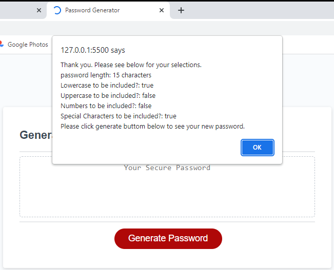
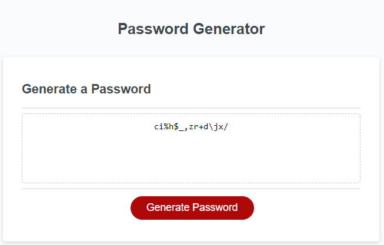

# PasswordGenerator-WC5
Repository to hold the code for Trilogy Bootcamp Weekly Challenge 5 - password generator

## Description

This project was undertaken as part of the Trilogy Education skills bootcamp.

We were tasked with creating a password generator which would provide the user with a series of options (password length and character base), and then generate a randomised password based on their inputs.

In this technological world, a strong password is essential to protecting your data.

## Installation

It requires no additional installations and will run in browser. file types include : HTML, CSS and Javascript

## Usage

Please use if you need to generate a random password of a specific length. 

*screenshot of alert with user inputs*

*screenshot of password generated using above inputs*

This project can be used by potential employers to show demonstration of my knowledge of functions, forloops and if statements.

It can also be used by others to see how I approaced the challenge.

## Credits

Trilogy Education for the provision of the started code.

## License

Please see repo for license information

## Tests

In the javascript file on line 206 there are some checks which I have commented out. Please uncomment these if you would like to see some of the infomation being stored/produced in the console log. I found these checks particularly useful when writing the code. 

## Page link

https://ncstorey.github.io/PasswordGenerator-WC5/ 